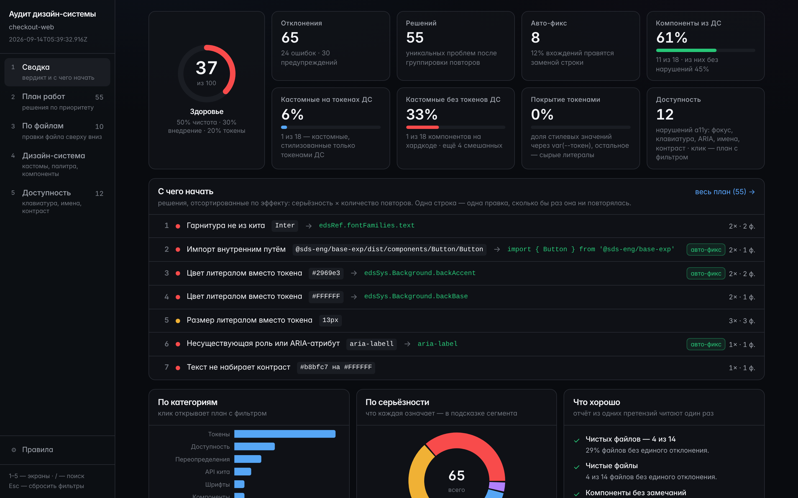
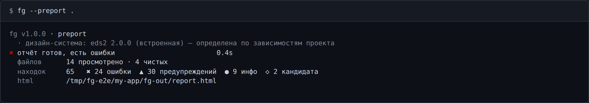
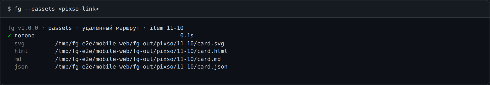

# Frontend Guard

`fg` — утилита командной строки: читает фронтенд-проект как есть и отдаёт отчёт по доступности,
дизайн-системе, компонентам и иконкам, а из макета Pixso собирает готовые артефакты.



## Что на выходе

- **Один самодостаточный `report.html`** — интерактивный дашборд: открывается двойным кликом,
  работает офлайн, в сеть не ходит.
- **Проверяемому проекту ничего не нужно** — ни зависимостей, ни сборки: анализ читает исходники.
- **Один проход — сколько угодно форматов**: `html`, `compact`, `json`, `sarif`.
- **Код возврата роняет сборку**: `0` — ошибок нет, `1` — есть ошибки, `2` — неверный вызов.
- **Макет Pixso → svg / html / md / json** одной командой.

## Установка

Дистрибутив — один файл `fg.mjs` в корне репозитория: внутри всё, внешних зависимостей нет.

```bash
git clone <repo>
node <repo>/fg.mjs --help
```

Нужен Node 24+. Файл можно скопировать куда угодно и запускать оттуда.

Файл кладут в репозиторий на релизе. Если на вашем чекауте его нет — соберите сами:
`pnpm install && pnpm release` (подробнее — [CONTRIBUTING.md](docs/CONTRIBUTING.md)).

## Две основные команды

### 1. Отчёт по проекту — `--preport`

```bash
fg --preport .                                  # → ./fg-out/report.html
fg --preport . --format compact                 # находки в консоль
fg --preport . --format html,sarif -o ./report  # два документа за один проход
```



Аргумент — каталог на диске или ссылка на репозиторий (`http(s)://…`, `git@…`, `file://…`);
репозиторий клонируется во временный каталог и удаляется после анализа. Дизайн-система
(`eds` 1.x / `eds2` 2.x) определяется по зависимостям проекта, снимок обеих вшит в бандл.

Подробно: [docs/manual/project-report.md](docs/manual/project-report.md).

### 2. Кадр Pixso → четыре файла — `--passets`

```bash
export PIXSO_REMOTE_MCP_TOKEN=<ваш токен>   # токен удалённого MCP, см. docs/manual/env.md
fg --passets <pixso-link>                   # → ./fg-out/pixso/<item-id>/card.{svg,html,md,json}
fg --passets <pixso-link> -o ./card         # -o задаёт каталог
```



`<pixso-link>` — ссылка на кадр из Pixso («Поделиться → Копировать ссылку»), в ней есть `item-id`.

Каталог по умолчанию назван по этому `item-id`, приведённому к безопасному имени файла: на снимке
выше это `./fg-out/pixso/11-10/`, внутри — четыре `card.*`. Токен можно не экспортировать, а
положить строкой `PIXSO_REMOTE_MCP_TOKEN=…` в `./.env` рядом с местом запуска.

Один запрос к макету → четыре файла. Рядом — три команды по одному файлу каждая: `--psvg` (SVG),
`--phtml` (HTML), `--pprompt` (Markdown-промпт для LLM).

Подробно: [docs/manual/pixso.md](docs/manual/pixso.md), переменные — [docs/manual/env.md](docs/manual/env.md).

## Роли

- [Разработчик](docs/manual/roles/developer.md) — прогнать свой проект и починить найденное.
- [Дизайнер](docs/manual/roles/designer.md) — достать кадр из макета, собрать корпус дизайн-системы.
- [Ревьюер / тимлид](docs/manual/roles/lead.md) — читать дашборд, следить за здоровьем и
  внедрением, понижать правила конфигом.

## Документация

| Документ | О чём |
| --- | --- |
| [manual/project-report.md](docs/manual/project-report.md) | `--preport`: флаги, форматы, `-o`, коды возврата, конфиг правил |
| [manual/pixso.md](docs/manual/pixso.md) | `--psvg/--phtml/--pprompt/--passets`, маршруты, токен |
| [manual/init-config.md](docs/manual/init-config.md) | `--iconf`: `fg.config.json`, схема, `inherit` |
| [manual/parse-ui-kit.md](docs/manual/parse-ui-kit.md) | `--pkit`: пересборка корпуса дизайн-системы |
| [manual/env.md](docs/manual/env.md) | все переменные окружения и приоритет |
| [manual/ci.md](docs/manual/ci.md) | пайп, `sarif`/`json`, коды возврата, `NO_COLOR` |
| [manual/vscode.md](docs/manual/vscode.md) | задачи VS Code и просмотр SARIF |
| [ARCHITECTURE.md](docs/ARCHITECTURE.md) | пакеты, поток данных, инварианты, адаптеры |
| [CONTRIBUTING.md](docs/CONTRIBUTING.md) | инструменты, проверки, релиз, как добавить правило / команду / дизайн-систему |
| [CHANGELOG.md](docs/CHANGELOG.md) | что вошло в 1.0.0 |

Справка в самом инструменте: `fg --help`, по команде — `fg --help --preport`.
