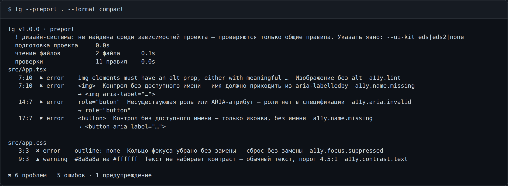
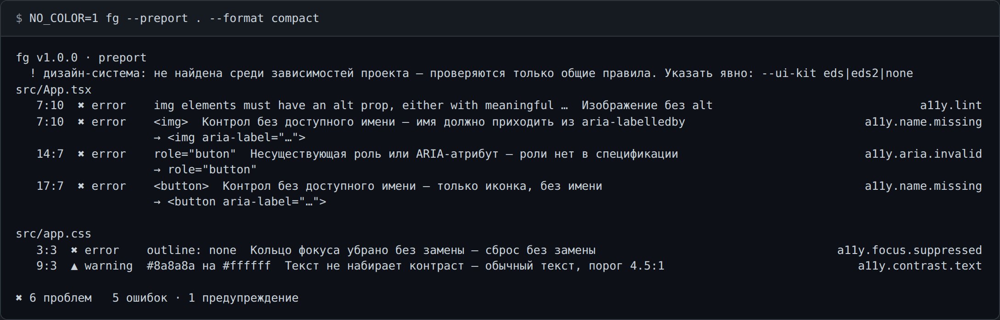

# CI и пайпы

## Потоки

`stdout` — **только данные**: документ формата `compact` либо абсолютные пути записанных файлов,
по одному в строке. Всё, что читает человек — заголовок, ход работы, предупреждения и итоговый
блок, — уходит в `stderr`.

```
$ fg --preport . 2>/dev/null
/…/fg-out/report.html

$ fg --preport . 2>&1 >/dev/null
fg v1.0.0 · preport
  подготовка проекта     0.0s
  …
✖ отчёт готов, есть ошибки                         0.1s
  файлов      2 просмотрено · 0 чистых
  находок     6   ✖ 5 ошибок  ▲ 1 предупреждение
  html        /…/fg-out/report.html
```

Отказ — не данные: при ошибке вызова `stdout` пуст, сообщение идёт в `stderr`.

В **терминале** пути в stdout не печатаются: они уже есть в итоговом блоке, дублировать незачем.
В пайпе они появляются, поэтому `fg --preport . | tail -1` отдаёт путь к отчёту, а
`fg --iconf | tail -2` — пару путей.



Режим вывода выбирается по TTY-ности потока: в терминале — живая строка с перерисовкой,
в пайпе — по строке на фазу с её временем.

## Коды возврата

| Код | Когда |
| --- | --- |
| `0` | видимых ошибок нет |
| `1` | осталась видимая находка уровня `error` — **в любом формате**, включая обычный HTML-отчёт; либо запуск сорвался |
| `2` | неверный вызов: неизвестный флаг, неизвестный формат, нет аргумента, флаг не для этой команды, две команды за раз, неизвестный язык |

Отдельного флага для CI не нужно:

```bash
fg --preport .                     # 1, если есть видимые ошибки
fg --preport . --format compact    # то же самое, плюс находки в логе сборки
```

Что считать ошибкой — решает `fg.config.json`. Например, уронить сборку только на доступности:

```json
{ "analyzer": { "default": "warning", "categories": { "a11y": "error" } } }
```

## SARIF и JSON

С IDE и платформами интегрируются через `sarif`, а не разбором консольного текста.

```bash
fg --preport . --format sarif             # → ./fg-out/report.sarif
fg --preport . --format sarif -o fg.sarif
fg --preport . --format json              # массив в форме `eslint -f json`
```

`report.sarif` — SARIF 2.1.0 (`"$schema": "https://json.schemastore.org/sarif-2.1.0.json"`), с
каталогом правил в `runs[0].tool.driver.rules`.

GitHub code scanning:

```yaml
- run: fg --preport . --format sarif -o fg.sarif
  continue-on-error: true # шаг сам вернёт 1, если есть ошибки
- uses: github/codeql-action/upload-sarif@v3
  with:
    sarif_file: fg.sarif
```

## `NO_COLOR`

`NO_COLOR` с любым непустым значением убирает SGR-последовательности. Это выключатель **цвета**,
а не терминала: живая строка с перерисовкой в настоящем терминале остаётся, режим вывода не
меняется. В пайпе цвета нет и без переменной.



Обратный случай — `FORCE_COLOR`: непустое значение (кроме `0` / `false`) включает цвет там, где
пайп его выключил бы. Полный список — [env.md](env.md).
