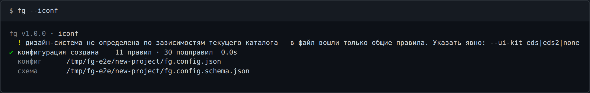

# `--iconf` — `fg.config.json` и схема

```
fg --iconf [-o <файл>] [--ui-kit …]
  также: --init-config
```

Пишет два файла: конфигурацию со всеми правилами выбранной дизайн-системы и JSON-схему к ней.
Без `-o` — `./fg.config.json`, схема кладётся рядом.



```bash
fg --iconf                       # 11 правил · 30 подправил (кит не определён)
fg --iconf --ui-kit eds          # 32 правила · 30 подправил
fg --iconf --ui-kit eds2         # 32 правила · 30 подправил — файл подходит обеим версиям
fg --iconf -o ./ci/fg.config.json
```

Дизайн-система берётся из `--ui-kit` либо определяется по зависимостям текущего каталога; если
не подошло ничего, в файл войдут только общие правила — команда об этом предупредит.

**Существующий файл никогда не перезаписывается** — код возврата 2 и сообщение с путём:

```
✖ файл уже существует: …/fg.config.json. Удалите или переименуйте его, либо укажите другой путь через -o — команда никогда не перезаписывает конфигурацию
```

## Устройство файла

```jsonc
{
  "$schema": "./fg.config.schema.json",
  "analyzer": {
    "uiKit": "eds",              // необязательно; флаг --ui-kit важнее; "none" — без кита
    "ignore": ["src/legacy/**"], // необязательно; синтаксис .gitignore, поверх встроенного списка
    "default": "on",             // уровень для всего, что не названо явно
    "categories": { "a11y": "error", "icon": "on", "token": "off" },
    "rules": {
      "a11y.contrast.text": "off",      // конкретное правило
      "style.override": "info",         // ПРЕФИКС: покрывает style.override.*
      "a11y.lint/alt-text": "warning",  // подправило: <правило>/<подвид>
      "component.duplicate": "inherit"  // «мнения нет» — решит категория
    }
  }
}
```

Комментарии выше — для читателя: файл разбирается как обычный JSON, `//` и висячие запятые в нём
недопустимы. Ключи верхнего уровня, кроме `$schema` и `analyzer`, игнорируются.

## `inherit`

Сгенерированный файл перечисляет **все** правила и категории со значением `inherit`. Это не
«ничего не настроено», а «здесь мнения нет»: имена видны и дополняются в редакторе, но решают
`categories` и `default`, пока правилу не задан собственный уровень. Иначе строка правила всегда
била бы по категории — правило специфичнее, — и «оставить только иконки» нельзя было бы выразить
в файле, который создаёт сам инструмент:

```jsonc
{
  "analyzer": {
    "default": "off",
    "categories": { "icon": "on" },
    "rules": {}
  }
}
```

Загрузчик выбрасывает каждый `inherit` раньше, чем конфиг увидит анализатор: движок знает шесть
уровней, `inherit` живёт только в файле.

## Схема

`fg.config.schema.json` нужна редактору: автодополнение имён правил, список допустимых уровней и
подсказка по наведению со встроенным уровнем правила («встроенный уровень: error — …»).
Заголовки и описания схемы локализованы по `--lang`. `$schema` в конфигурации указывает на схему
относительным путём, так что пару можно скопировать в другой репозиторий.

Незнакомое имя правила — **предупреждение, а не ошибка**: один файл может обслуживать проекты на
разных дизайн-системах. Сломанный JSON, несуществующая категория или несуществующий уровень —
ошибка ввода: код 2 и сообщение с именем ключа.

Как уровни складываются в итоговую серьёзность — [project-report.md](project-report.md).
