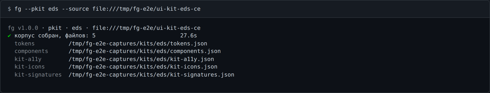

# `--pkit` — пересборка корпуса дизайн-системы

```
fg --pkit eds|eds2 [--source …]
  также: --parse-ui-kit
```

В бандл вшит снимок каждой дизайн-системы — токены, компоненты, иконки, публичные сигнатуры и
правила доступности. По нему `--preport` отличает «свой» компонент от чужого и подсказывает
штатную замену. Снимок замирает в момент сборки `fg`, а дизайн-система живёт дальше; `--pkit`
пересобирает его из исходников **на вашей машине, поверх встроенного**.



```bash
fg --pkit eds                                  # → ~/.fg/kits/eds/
fg --pkit eds2                                 # 2.x, ветка develop-2.0
fg --pkit eds --source ../ui-kit-eds-ce        # из локального клона
FG_KITS_DIR=./kits fg --pkit eds               # → ./kits/eds/
```

## Что делает команда

1. **Берёт исходники.** Без `--source` — официальный репозиторий этой дизайн-системы; он
   клонируется во временный каталог и удаляется следом. С `--source` — ваш каталог на диске или
   другая ссылка (`http(s)://…`, `git@…`, `file://…`). Локальный каталог остаётся как был.
2. **Ставит опубликованный пакет дизайн-системы** во временный каталог — нужен `npm` в `PATH`.
   Для `eds2` шаг пропускается: 2.x ничего не оборачивает.
3. **Извлекает пять артефактов** и пишет их в каталог корпуса.

## Куда попадают файлы

`~/.fg/kits/eds/` и `~/.fg/kits/eds2/` — каталог на каждую, версии не мешают друг другу.

| Файл | Что внутри |
| --- | --- |
| `tokens.json` | дизайн-токены обеих тем |
| `components.json` | компоненты дизайн-системы и их свойства |
| `kit-a11y.json` | правила доступности, снятые с дизайн-системы |
| `kit-icons.json` | иконки дизайн-системы |
| `kit-signatures.json` | публичные сигнатуры пакетов |

Корень переносится переменной `FG_KITS_DIR` — туда же потом смотрит `--preport`
(см. [env.md](env.md)). Относительный путь разворачивается в абсолютный.

**Флага `-o` у команды нет**, и переданный `-o` не игнорируется молча:

```
$ fg --pkit eds -o ./corpus
✖ флаг -o не поддерживается командой --pkit.
  использование:  fg --pkit eds|eds2 [--source …]
  подробнее:      fg --help --pkit
```

## Что видно в отчёте

Без пересборки `--preport` называет встроенный снимок:

```
· дизайн-система: eds2 2.0.0 (встроенная) — определена по зависимостям проекта
```

После `fg --pkit` в этой строке появляются дата сборки корпуса и коммит исходников. То же уходит
в `report.html`, так что по отчёту видно, на каких данных он построен.

**Испорченный корпус не ломает запуск.** Файл, не прошедший проверку, даёт предупреждение с
именем файла и причиной, после чего анализ идёт по встроенному снимку:

```
! файл корпуса eds2 не прошёл проверку: …/kits/eds2/tokens.json (missing meta.corpus — this file
  was not written by "fg --parse-ui-kit eds2"). Используется встроенный снимок. Соберите корпус
  заново: fg --parse-ui-kit eds2
```

Пустого каталога это не касается: на свежей машине он пуст всегда, и команда об этом молчит.
