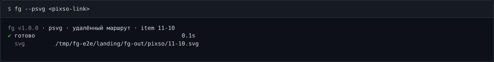
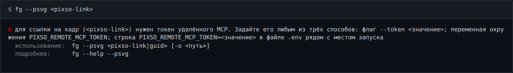
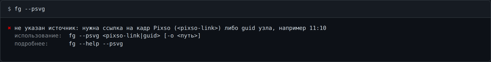

# Pixso: макет → код

Четыре команды превращают кадр Pixso в артефакт.

| Команда | Полное имя | Что отдаёт | Без `-o` |
| --- | --- | --- | --- |
| `--psvg` | `--get-pixso-svg` | SVG кадра | `./fg-out/pixso/<имя>.svg` |
| `--phtml` | `--get-pixso-html` | HTML кадра | `./fg-out/pixso/<имя>.html` |
| `--pprompt` | `--get-pixso-prompt` | Markdown-промпт | `./fg-out/pixso/<имя>.md` |
| `--passets` | `--get-pixso-assets` | `card.svg` + `card.html` + `card.md` + `card.json` | `./fg-out/pixso/<имя>/` |


`--passets` обращается к макету **ровно один раз** и раскладывает один скан в четыре файла.

## Аргумент — ссылка на кадр

`<pixso-link>` — ссылка на кадр из Pixso («Поделиться → Копировать ссылку»), в ней есть
`item-id`. Это основной рабочий маршрут — **удалённый**. Команде нужен только токен удалённого
MCP: ни плагина, ни открытого редактора, ни той же машины, где лежит макет, не требуется.

```bash
export PIXSO_REMOTE_MCP_TOKEN=<ваш токен>
fg --psvg <pixso-link>
```

Вместо `export` строку можно положить в `./.env` рядом с местом запуска — файл читается
автоматически:

```
PIXSO_REMOTE_MCP_TOKEN=<ваш токен>
```



Без токена ссылка отклоняется с кодом 2 ещё до обращения к сети, и в отказе перечислены все три
способа его задать:



## Имя файла

`<имя>` — это `item-id` из ссылки, приведённый к безопасному имени файла: всё, кроме латиницы,
цифр и `. _ -`, заменяется на `-` (подряд идущие — одним), ведущие и хвостовые `-` и `.`
убираются, длина режется до 64 символов. Двоеточие внутри `item-id` под первое правило и
попадает, поэтому кадр со снимков выше даёт файл `./fg-out/pixso/11-10.svg`, а у `--passets` —
каталог `./fg-out/pixso/11-10/` с четырьмя `card.*` внутри.

Тот же кадр, названный guid'ом узла (см. «Локальный маршрут»), даёт **тот же** файл: имя следует
за дизайном, а не за написанием аргумента.

## Доступ

| Переменная | Что задаёт | Перебивается флагом |
| --- | --- | --- |
| `PIXSO_REMOTE_MCP_TOKEN` | токен для удалённого маршрута | `--token <token>` |
| `PIXSO_REMOTE_MCP_URL` | адрес удалённого MCP | `--endpoint <url>` |
| `PIXSO_LOCAL_MCP_URL` | адрес локального MCP | `--endpoint <url>` |

`--endpoint` перебивает **обе** URL-переменные: маршрут выбирается по аргументу, так что в дело
всё равно пойдёт ровно одна из них.

Приоритет — **флаг > env / `.env` > умолчание**. Полный список переменных и правила `.env` —
[env.md](env.md).

## Примеры

```bash
fg --psvg <pixso-link>                    # → ./fg-out/pixso/<item-id>.svg
fg --phtml <pixso-link> -o ./card.html
fg --pprompt <pixso-link> -o ./card.md
fg --passets <pixso-link>                 # → ./fg-out/pixso/<item-id>/
fg --passets <pixso-link> -o ./out/card   # -o = каталог
```

Без источника — отказ с кодом 2:



Флаг, которого у команды нет, тоже не проглатывается молча:

```
$ fg --psvg <pixso-link> --config ./fg.config.json
✖ флаг --config не поддерживается командой --psvg.
```

## Локальный маршрут

Случай для продвинутых, и описан он только здесь. Если Pixso открыт на этой же машине и его
плагин поднял локальный MCP, аргументом может быть **guid узла** — `11:10`, как он выглядит в
редакторе; отдельного флага нет: всё, что не `http(s)://…`, идёт локально.

```bash
fg --psvg 11:10                           # → ./fg-out/pixso/11-10.svg
```

Токен не нужен, адрес задаёт `PIXSO_LOCAL_MCP_URL`, редактор должен быть открыт: закрытый
плагин — отказ с кодом 1, а не переход на удалённый маршрут.
