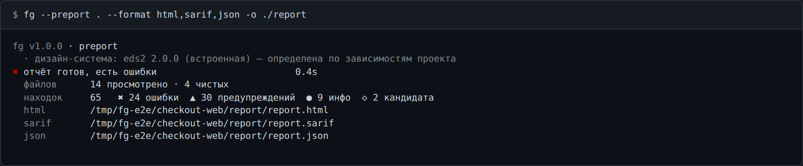
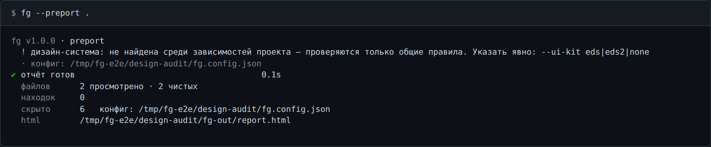

# `--preport` — отчёт по проекту

```
fg --preport <путь|repo> [-o <путь>] [--format …] [--ui-kit …] [--config …]
  также: --project-report
```

Доступность, компоненты, иконки, дизайн-система. Аргумент — каталог на диске либо ссылка на
репозиторий (`http(s)://…`, `git@…`, `file://…`); репозиторий клонируется во временный каталог
и удаляется после анализа.


## Флаги

| Флаг | Что делает |
| --- | --- |
| `<путь\|repo>` | каталог проекта или ссылка на репозиторий |
| `-o <путь>` | куда писать; необязателен |
| `--format html\|compact\|json\|sarif` | что произвести; несколько через запятую, по умолчанию `html` |
| `--ui-kit eds\|eds2\|none` | какую дизайн-систему учитывать; без флага — по зависимостям |
| `--config <файл>` | путь к `fg.config.json` |
| `--verbose` | в `compact` под каждой находкой — объяснение «почему» |
| `--lang ru\|en` | язык вывода (по умолчанию `ru`) |

## Форматы

| Формат | Что это | Куда |
| --- | --- | --- |
| `html` | самодостаточный интерактивный отчёт (по умолчанию) | файл |
| `compact` | находки в консоль | stdout |
| `json` | массив в форме `eslint -f json` | файл |
| `sarif` | SARIF 2.1.0 для IDE и CI | файл |

Проект читается и проверяется **один раз**, сколько бы форматов ни попросили. Порядок в списке
не важен, повторы игнорируются.


## `-o`

- один формат-файл → `-o` называет **файл**;
- несколько → `-o` называет **каталог**, внутри появятся `report.html`, `report.sarif`, `report.json`;
- без `-o` → `./fg-out/report.<ext>`; недостающие каталоги создаются;
- `--format compact -o …` — ошибка вызова (код 2): `compact` уходит в stdout и файла не имеет.



Пути в итоговом блоке всегда абсолютные. В пайпе они же уходят в stdout по одному в строке, а в
терминале — только в блок, чтобы не печатать дважды.

## Коды возврата

| Код | Когда |
| --- | --- |
| `0` | видимых ошибок нет (в том числе когда их понизил конфиг) |
| `1` | осталась хотя бы одна видимая находка уровня `error` — в любом формате; либо запуск сорвался |
| `2` | неверный вызов |

## `--ui-kit`

Без флага дизайн-система определяется по зависимостям проекта: `@sds-eng/base` → `eds`,
`@sds-eng/base-exp` / `@sds-eng/kit-exp` → `eds2`. Снимок обеих вшит в бандл, ставить ничего не
нужно. Если не подошло ничего, работают только общие правила — команда об этом предупреждает:

```
! дизайн-система: не найдена среди зависимостей проекта — проверяются только общие правила. Указать явно: --ui-kit eds|eds2|none
```

`--ui-kit none` отключает правила дизайн-системы: остаются 11 общих.

## Корпус дизайн-системы

Пока в `~/.fg/kits/<кит>/` нет корпуса, собранного [`fg --pkit`](parse-ui-kit.md), отчёт
считается по встроенному снимку. Каталог переносится переменной `FG_KITS_DIR` (см.
[env.md](env.md)). Испорченный или не прошедший проверку файл корпуса запуск не роняет: команда
предупреждает, называя файл и причину, и возвращается к встроенному снимку.

## Лимит размера файла

Код и стили читаются целиком, поэтому файл крупнее 1 МиБ (обычно сгенерированный, а не написанный
руками) пропускается без разбора и попадает в ограничения отчёта с причиной «файл слишком большой».

## `--config` и уровни правил

```bash
fg --iconf                                   # создать fg.config.json и схему
fg --preport .                               # файл подхватится сам
fg --preport . --config ./ci/fg.config.json  # …или явно
```

Порядок поиска — побеждает первый найденный:

```
--config <path>  >  <корень проекта>/fg.config.json  >  <текущий каталог>/fg.config.json  >  встроенные умолчания
```

Уровень конкретной находки выбирается сверху вниз:

```
rules["<правило>/<подвид>"]  >  самый длинный подходящий ключ в rules  >  categories[<категория>]  >  default
```

| Уровень | Что значит |
| --- | --- |
| `off` | находки правила не показываются и не считаются |
| `on` | оставить собственную серьёзность правила |
| `error` / `warning` / `info` / `candidate` | назначить серьёзность принудительно |
| `inherit` | «мнения нет» — решает следующая ступень; существует только в файле |

Восемь категорий: `token`, `typography`, `font`, `api`, `override`, `component`, `icon`, `a11y`.

Правила всегда выполняются целиком — конфигурация ложится **слоем** поверх результата. Поэтому в
HTML-отчёт попадают все находки, а панель «Правила» в дашборде возвращает выключенное обратно
без перезапуска. Строка `скрыто` в итоговом блоке говорит, сколько находок убрал конфиг и какой
файл при этом действовал.



Подробнее о самом файле — [init-config.md](init-config.md).
