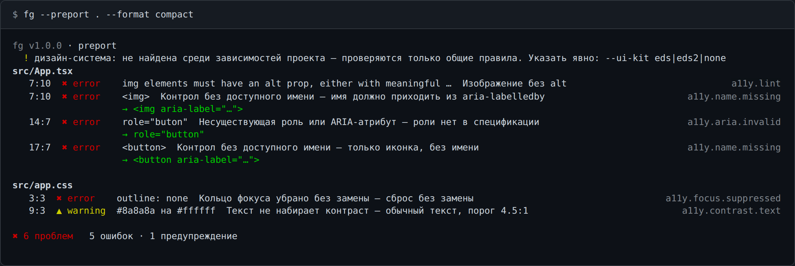

# Роль: разработчик

Задача — прогнать свой проект и починить найденное.

## Первый запуск

```bash
node <repo>/fg.mjs --preport .
```

Проверяемому проекту ничего не нужно: ни зависимостей, ни сборки. Дизайн-система определяется по
зависимостям, снимок вшит в бандл. Без `-o` отчёт ложится в `./fg-out/report.html` — открывается
двойным кликом, работает офлайн.

## Работа в консоли

```bash
fg --preport . --format compact            # находки списком
fg --preport . --format compact --verbose  # + объяснение «почему» под каждой
```

Строка находки — `строка:колонка`, глиф и серьёзность (`✖ error`, `▲ warning`, `● info`,
`◇ candidate`), само значение из кода, короткое имя правила и его id справа. Строка `→ …` под
находкой — чем заменить.



## Код возврата

`0` — видимых ошибок нет, `1` — есть, `2` — вызов неверный. Сборка смотрит на тот же код, так что
локально видно ровно то, что увидит CI ([ci.md](../ci.md)).

## Что не показывать

```bash
fg --iconf              # fg.config.json + схема
```

Дальше правится один файл: `default`, восемь категорий, конкретные правила. Все строки
сгенерированного файла — `inherit`, то есть «мнения нет», поэтому хватит назвать категорию:

```json
{ "analyzer": { "default": "off", "categories": { "a11y": "on" } } }
```

Правила при этом продолжают выполняться — конфигурация ложится слоем поверх результата, и панель
«Правила» в HTML-отчёте вернёт скрытое обратно без перезапуска.
Подробно — [init-config.md](../init-config.md) и [project-report.md](../project-report.md).

## Куда что пишется

| Команда | Без `-o` |
| --- | --- |
| `--preport` | `./fg-out/report.<ext>` |
| `--iconf` | `./fg.config.json` + `./fg.config.schema.json` |
| `--psvg` / `--phtml` / `--pprompt` | `./fg-out/pixso/<имя>.<ext>` |
| `--passets` | `./fg-out/pixso/<имя>/` |

Пути в итоговом блоке всегда абсолютные; в пайпе они же уходят в stdout по одному в строке.

## Дальше

- все флаги `--preport` — [project-report.md](../project-report.md);
- IDE и CI — [ci.md](../ci.md), [vscode.md](../vscode.md);
- переменные окружения — [env.md](../env.md).
