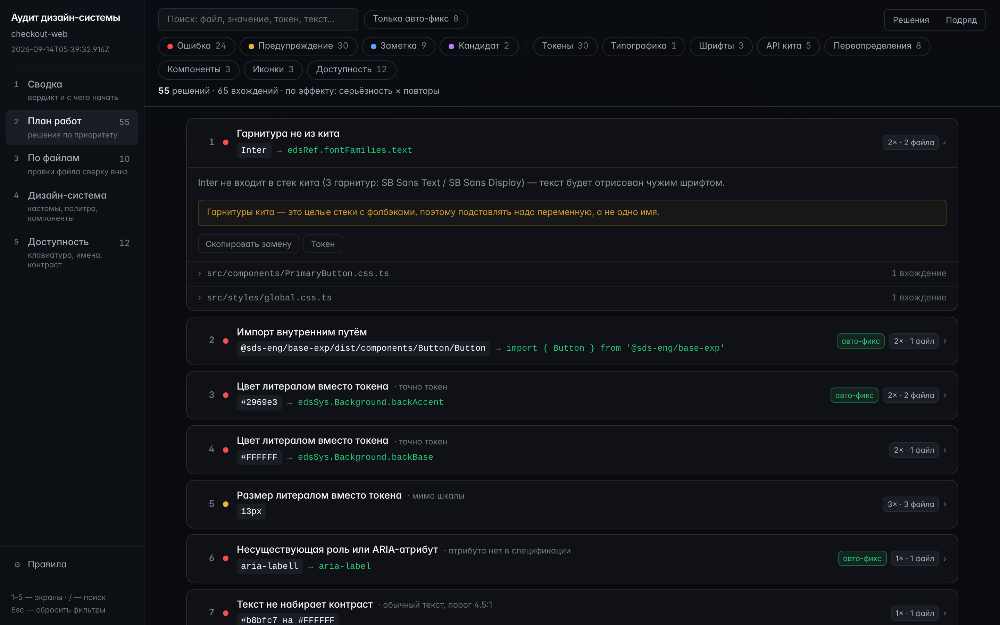

# Роль: ревьюер / тимлид

Читать дашборд, следить за здоровьем и внедрением, решать конфигом, что считать ошибкой.

## Дашборд

```bash
fg --preport . -o ./report.html
```

Один самодостаточный файл: открывается двойным кликом, работает офлайн, его можно приложить к
задаче или сохранить как срез проекта на сегодня.


Пять экранов в боковой панели (клавиши `1`–`5`), панель «Правила» внизу, `/` — поиск,
`Esc` — сбросить фильтры:

| Экран | О чём |
| --- | --- |
| **Сводка** | вердикт и с чего начать |
| **План работ** | решения по приоритету |
| **По файлам** | правки файла сверху вниз |
| **Дизайн-система** | кастомы, палитра, компоненты |
| **Доступность** | клавиатура, имена, контраст |

## Метрики на «Сводке»

- **Здоровье** — общий балл из 100: чистота, внедрение и токены (доли подписаны под кольцом).
- **Отклонения** — сколько находок и как они разложены по серьёзности.
- **Решений** — уникальные проблемы после группировки повторов: одна строка — одна правка,
  сколько бы раз она ни повторялась.
- **Авто-фикс** — доля вхождений, которые чинятся заменой строки.
- **Компоненты из ДС**, **Кастомные на токенах ДС**, **Кастомные без токенов ДС**, **Покрытие
  токенами**, **Доступность** — внедрение дизайн-системы и его цена.

Блок «С чего начать» сортирует решения по эффекту: серьёзность × количество повторов.

## План работ



Каждое решение раскрывается: объяснение, замена, список файлов с числом вхождений. Фильтры по
серьёзности и по категориям — сверху; «Только авто-фикс» оставляет то, что чинится механически.

## Понижение правил конфигом

```bash
fg --iconf --ui-kit eds       # файл со всеми правилами, все строки `inherit`
```

Дальше — решение уровня команды, а не отдельного разработчика: что ошибка, что предупреждение,
что не показывать вовсе.

```json
{ "analyzer": { "default": "warning", "categories": { "a11y": "error" } } }
```

Такой файл роняет сборку только на доступности, остальное оставляет видимым как
предупреждения. Файл ищется в корне проекта, затем в текущем каталоге; `--config` перебивает
оба ([project-report.md](../project-report.md)).

**Важно:** правила всегда выполняются целиком, конфиг ложится слоем поверх результата. В
HTML-отчёт попадают все находки, а панель «Правила» даёт читателю вернуть выключенное обратно,
ничего не перезапуская. Строка `скрыто` в итоговом блоке говорит, сколько находок убрал конфиг и
какой файл при этом действовал.

## Код возврата

Код возврата `1` — есть видимые ошибки, в любом формате, включая HTML. Никакого отдельного флага
для CI не нужно: [ci.md](../ci.md).
